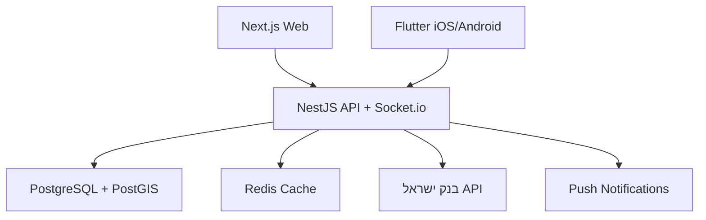

# תכנון אפליקציית P2P מט"ח

---

## פירוק לשלבים — עם תוצר גלוי בכל שלב

### שלב 1 — תשתית פרויקט

**מה עושים:** Monorepo (apps/backend, apps/web, apps/mobile), Docker Compose עם PostgreSQL + PostGIS + Redis, NestJS skeleton עם health endpoint.

**מה רואים בסוף השלב:** `GET /health` מחזיר `{ status: "ok" }`, DB ו-Redis מחוברים ועולים עם פקודה אחת (`docker compose up`).

---

### שלב 2 — Auth API

**מה עושים:** Register, Login, JWT tokens, middleware להגנה על routes. סכמת `users` ב-DB.

**מה רואים בסוף השלב:** ב-Postman (או curl) — רישום משתמש, לוגין, קבלת token, גישה ל-endpoint מוגן.

---

### שלב 3 — שער יציג + Offers API

**מה עושים:** משיכת שער יציג יומי מ-API של בנק ישראל (ומחסן ב-Redis), CRUD להצעות, חיפוש הצעות לפי מיקום + טווח עם PostGIS, סכמת `offers` ב-DB.

**מה רואים בסוף השלב:** `GET /rates` מחזיר שערי USD/EUR/GBP. `GET /offers?lat=32.08&lng=34.78&radius=5` מחזיר הצעות ממוינות לפי מרחק.

---

### שלב 4 — Web: Browse Mode (ללא לוגין)

**מה עושים:** Next.js project, עמוד ראשי עם רשימת הצעות, שם מוסתר ("אביב ח."), מרחק משוער, פילטר לפי מטבע, שער יציג בראש העמוד, seed data להדגמה.

**מה רואים בסוף השלב:** דף אינטרנט יפה ועובד עם הצעות אמיתיות מה-DB, פילטרים פועלים, שם מוסתר.

---

### שלב 5 — Web: Auth + יצירת הצעה

**מה עושים:** עמודי Register/Login, טופס יצירת הצעה (מטבע, סכום, אזור, כיוון), dashboard "ההצעות שלי", הגנה על routes מאחורי auth.

**מה רואים בסוף השלב:** flow מלא — נרשמים, מתחברים, מפרסמים הצעה, ורואים אותה מופיעה בעמוד הראשי.

---

### שלב 6 — Web: צ'אט + אישור עסקה

**מה עושים:** Socket.io בשרת ובלקוח, פתיחת שיחה בין קונה למוכר, כפתור "השלמתי עסקה" לשני הצדדים, מעבר סטטוס הצעה ל-COMPLETED.

**מה רואים בסוף השלב:** שני טאבים בדפדפן (שני משתמשים שונים) מתכתבים בזמן אמת, ואחרי אישור שני הצדדים העסקה נסגרת.

---

### שלב 7 — מערכת דירוגים

**מה עושים:** טופס דירוג (1–5 כוכבים + הערה) שמופיע לאחר סגירת עסקה, חישוב ממוצע, badge ירוק/כתום/אדום על כל הצעה, דף פרופיל ציבורי.

**מה רואים בסוף השלב:** badge דירוג על הצעות בדף הראשי, דף פרופיל עם היסטוריית ביקורות.

---

### שלב 8 — Flutter Mobile (iOS + Android)

**מה עושים:** Flutter project, מסכים מקבילים לweb (Browse, Login, Create Offer, Chat), location permissions, Push Notifications (Firebase).

**מה רואים בסוף השלב:** אפליקציה עובדת על סימולטור/מכשיר, מחוברת לאותו backend, כולל קבלת התראה כשמישהו שולח הודעה.

---

## סטאק טכנולוגי מומלץ

- **Mobile (iOS + Android):** Flutter — codebase אחד לשני הפלטפורמות
- **Web:** Next.js (React)
- **Backend:** NestJS (Node.js, TypeScript) — מובנה, מודולרי, REST + WebSocket
- **DB:** PostgreSQL + PostGIS (שאילתות גיאוגרפיות)
- **Cache:** Redis (שערי מטבע, sessions)
- **Real-time:** Socket.io (צ'אט בין משתמשים)
- **שער יציג:** API של בנק ישראל (חינמי, יומי)
- **Auth:** JWT + Google/Apple Sign-In

---

## ארכיטקטורה כללית

---

## סוגי משתמשים

- **משתמש רגיל** — פרטי, מחליף עם מכרים/אנשים קרובים
- **סוכנות מאומתת** (עתידי) — badge מיוחד, עמלה גלויה, כתובת פיזית

---

## מסכים ופיצ'רים

### לפני לוגין (Browse Mode)

- רשימת הצעות פעילות ממוינות לפי מרחק
- שם מוסתר חלקית: "אביב ח." (שם פרטי + אות ראשונה של שם משפחה)
- מרחק: מוצג כ"~2.3 ק"מ", הצעות מעבר לטווח מסוים — מוסתרות לחלוטין
- פילטר לפי מטבע (USD, EUR, GBP...)
- שער יציג נוכחי מוצג תמיד בראש
- לחצן "צור קשר" → מפנה ללוגין

### אחרי לוגין

- יצירת הצעה (קנייה / מכירה)
- צ'אט עם משתמש לאחר התאמה
- אישור השלמת עסקה (שני הצדדים מאשרים)
- דירוג לאחר עסקה
- היסטוריית עסקאות

---

## יצירת הצעה

- סוג: קנייה / מכירה
- מטבע (USD, EUR, GBP, ועוד)
- סכום (גמיש — "עד X" או מדויק)
- אזור מפגש: שכונה / עיר (לא כתובת מדויקת!)
- שעות זמינות
- מחיר: שער יציג בלבד (ללא סטייה — שמירה על שוויוניות)
- תפוגה אוטומטית (24/48 שעות)

---

## מערכת דירוגים

- דירוג 1–5 כוכבים + תגובה אופציונלית
- מוצג רק לאחר מינימום עסקאות (למניעת מניפולציה)
- Badge ירוק/כתום/אדום לפי ממוצע
- הצגת מספר עסקאות שהושלמו

---

## פיצ'רים שכדאי להוסיף (לא הוזכרו)

- **התראות (Alerts):** "הודע לי כשמישהו מוכר EUR קרוב אלי"
- **מחשבון מטבע:** המרה מהירה לפי שער יציג עדכני
- **המלצת נקודת מפגש:** הצעת מקומות ציבוריים בטוחים באזור (בית קפה, מרכז מסחרי)
- **אימות זהות:** selfie + ת"ז אופציונלי, מוסיף badge "מאומת"
- **דיווח/חסימת משתמש**
- **מצב "ניראות":** האם ההצעה שלי גלויה לאחרים כרגע (online/offline)
- **Multi-offer:** יוזר יכול לפרסם הצעות במספר מטבעות בו-זמנית

---

## מודל ה"סוכנויות" לעתיד

- tier נפרד במערכת המשתמשים (`is_verified_agency`)
- תהליך אימות מול הפלטפורמה (רישיון, כתובת)
- עמלה גלויה בהצעה (`commission_percent`)
- badge בולט + דירוג מוגבר

---

## מודל הנתונים העיקרי

**Users:** id, first_name, last_name, phone, email, location (PostGIS), rating_avg, rating_count, is_verified, is_agency

**Offers:** id, user_id, type (BUY/SELL), currency, amount, meeting_zone, location, status, expires_at

**Transactions:** id, offer_id, buyer_id, seller_id, amount, rate, status (PENDING → CONFIRMED → COMPLETED)

**Reviews:** id, transaction_id, reviewer_id, reviewee_id, rating, comment

**Messages:** id, transaction_id, sender_id, content, created_at

---

## שיקולי אבטחה וחוקיות

- מיקום משתמש: שמור בצורה מדויקת בשרת, אך מוצג לאחרים ברמת שכונה/רחוב כללי בלבד
- **שים לב:** בישראל, תיווך בהמרת מט"ח עשוי להיות כפוף לרגולציה של בנק ישראל — מומלץ לבדוק עם עורך דין לפני השקה
- אין טיפול בכסף ע"י הפלטפורמה (P2P ישיר) — מפשט רגולציה

